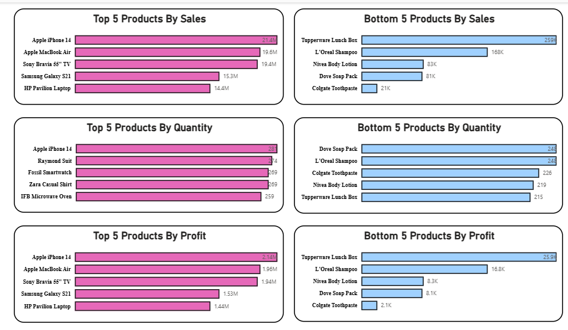
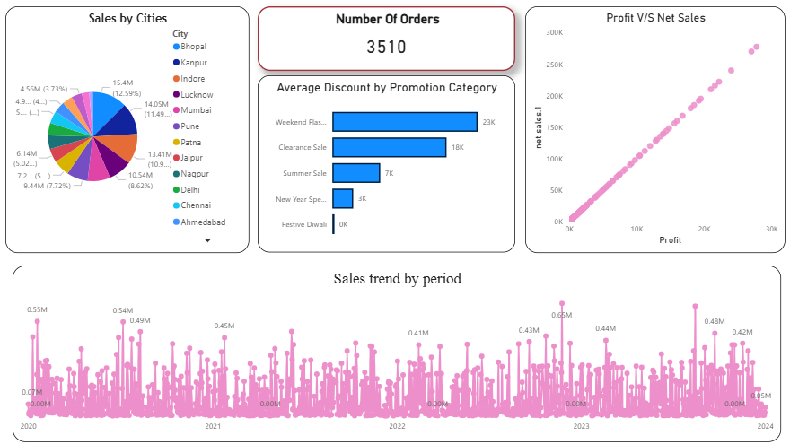
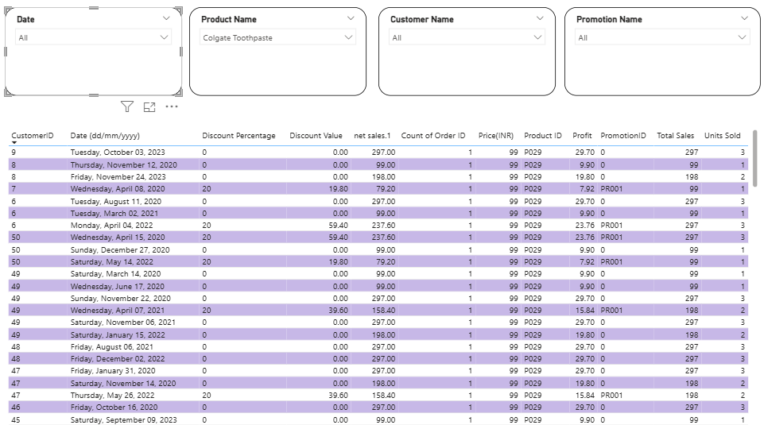

# Sales Dashboard (Power BI)

## Project Overview
Power BI dashboard designed to analyze sales performance and product insights.  
Highlights top and bottom products based on sales, profit, and quantity for better decision-making.

## Dataset
- **File Name:** `Store Data.xlsx`
- Includes:
  - Sales and profit data
  - Product and customer details
  - Quantity sold and pricing
  - Promotion and discount information

## Features
- Sales trend analysis over time
- Sales distribution by cities
- Profit vs Net Sales comparison
- Number of orders KPI tracking
- Discount analysis by promotion category
- Top & Bottom products (Sales, Profit, Quantity)
- Dynamic filtering (Date, Product, Customer, Promotion)

## Tools Used
- Power BI
- Microsoft Excel

## Files Included
- `sales_dashboard.pbix` → Main Power BI dashboard  
- `Store Data.xlsx` → Dataset  
- `sales_dashboard1.png` → Dashboard overview  
- `sales_dashboard2.png` → Sales insights & trends  
- `sales_dashboard3.png` → Detailed data view  

## Dashboard Preview

### Overview Dashboard

### Sales Insights & Trends

### Detailed Data & Filters

## How to Use
1. Download the `.pbix` file  
2. Open it in Power BI Desktop  
3. Use filters to explore different insights  
4. Analyze trends and product performance  

## Key Insights
- Apple iPhone 14 is a top-performing product in sales and profit  
- Certain products show high sales but lower profit margins  
- Discounts significantly impact revenue and profit  
- Sales trends fluctuate over time with noticeable peaks  
- Product performance varies across different metrics  

## GitHub Repository
[View Project on GitHub] (https://github.com/ManpreetKaur96/sales_dashboard)

## Author
Manpreet Kaur
